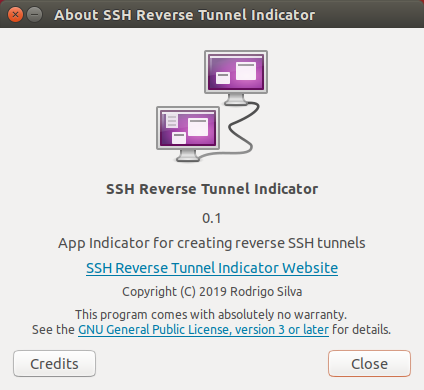
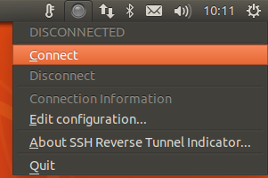
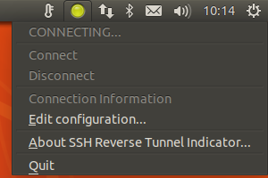
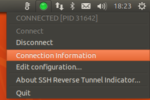
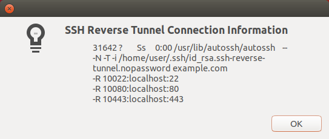

SSH Reverse Tunnel and Indicator
===============================================================================

## A wrapper to `autossh` with a handy desktop indicator




Installing
----------
```
git clone 'https://github.com/MestreLion/ssh-reverse-tunnel.git'
ssh-reverse-tunnel/install
```

This will:

- Install `autossh` on Debian/Ubuntu systems, if needed.
   (will use `sudo` and prompt for password)
- Symlink executables to `XDG_BIN_HOME`, by default `~/.local/bin`
- Install menu entry (`.desktop` file) and desktop icons for the indicator
- Set the indicator to start automatically on desktop login.
- Create a blank config file if it's missing, by default at
   `~/.config/ssh-reverse-tunnel.conf`


Usage
-----

### Initial configuration

- Before fist run, edit your config file at `~/.config/ssh-reverse-tunnel.conf`
  and fill in your connection details.

- On first run, `ssh-reverse-tunnel` will create a password-less SSH key pair at
   `~/.ssh/id_rsa.ssh-reverse-tunnel.nopassword`,
   (with its comment set as `${USER}.ssh-reverse-tunnel.nopassword@${HOSTNAME}`),
   and upload the public key to the configured server.
   This is the recommended way of running `autossh`, it creates permanent tunnels
   non-interactively, otherwise it would kind of defeat the whole point of this.


### Command-line

**Run:**
```
$ ssh-reverse-tunnel  # implicit --start
```
That's it, simple as that. Once configured it just works.

It reads the config file and invoke `autossh`, setting its pid file to
`~/.ssh/ssh-reverse-tunnel.pid` so its process can be managed / queried / killed.
It's also silent on success, like well-behaved *nix tools are (or should be).
Does not block, as once connected `autossh` is configured to set itself
as a daemon and runs on the background.

Running it again will close existing connections and re-connect.
Useful after editing config.

**Query status:**
```
$ ssh-reverse-tunnel --status   # -s works too
31642 ? Ss 0:00 /usr/lib/autossh/autossh --
-N -T -i /home/user/.ssh/id_rsa.ssh-reverse-tunnel.nopassword server
-R 10022:localhost:22
-R 10080:localhost:80
-R 10443:localhost:443
```

Looks familiar? Yes, this is the output of `ps`. Lame but handy.
Line breaks not included, sorry.
If not connected it will have no output and set a non-zero exit status.


**Close:**
```
$ ssh-reverse-tunnel --close   # or -c, --stop, --quit. So many options!
```

**Need help?**
```
$ ssh-reverse-tunnel --help
Create or close multiple SSH reverse tunnels
 Usage: ssh-reverse-tunnel [--close|--status]
```

Not very useful, I know. Patches for a `man` page are welcome!


### Indicator app

It comes with a sweet indicator app with gorgeous icons!







Familiar again, huh?

<sup>_Yes, this is a fake example, I wasn't really connected to `user@example.com`.
But the conveniently placed line breaks are for real now._</sup>


FAQ
---

- What the hell are _"SSH reverse tunnels"_, and why would I need them?
    - A very good question! That, unfortunately will be unanswered by now.
       But take a look at some
       [nice](https://www.howtogeek.com/428413/what-is-reverse-ssh-tunneling-and-how-to-use-it/)
       [tutorials](https://blog.devolutions.net/2017/3/what-is-reverse-ssh-port-forwarding),
       or [google it](https://www.google.com/search?q=ssh+reverse+tunnels)
       like I just did.

- What is this `autossh` you mention all over the place?
    - You really don't like Google, do you?
       You can always use [DuckDuckGo](https://duckduckgo.com/?q=autossh) if you want.
       Or, for the lazy ones: [autossh website](https://www.harding.motd.ca/autossh/)

- What about the config file? What is the format, syntax and options?
    - Yeah. that one does deserve some documentation. Now *I* am the lazy one.
       Maybe next commit perhaps.
       But it's a plain `key=value` text that is _sourced_ by `bash`,
       I'm sure you can figure it out.

- I don't want it to create a new, password-less SSH keypair to connect to my
   server, that is a **huge** security vulnerability! I want to use my own keys!
    - I totally agree! Well, just set `keyfile` in the config file to your
       favorite keypair prior to running `ssh-reverse-tunnel` for the first time.
       Or set it to an empty string and it will use your default keypair
       (or the one configured in `~/.ssh/config`, if you did so).
       But unless you have an SSH Agent, and even if so, you might have trouble
       with the indicator app and/or the daemonized `autossh`.
       It will also prevent you from creating your tunnels non-interactively,
       for instance on boot time, with `cron`, etc.


Contributing
------------

Patches are welcome! Fork, hack, request pull!

If you find a bug or have any enhancement request, please open a
[new issue](https://github.com/MestreLion/ssh-reverse-tunnel/issues/new)


Author
------

Rodrigo Silva (MestreLion) <linux@rodrigosilva.com>


License and Copyright
---------------------
```
Copyright (C) 2019 Rodrigo Silva (MestreLion) <linux@rodrigosilva.com>.
License GPLv3+: GNU GPL version 3 or later <http://gnu.org/licenses/gpl.html>.
This is free software: you are free to change and redistribute it.
There is NO WARRANTY, to the extent permitted by law.
```
